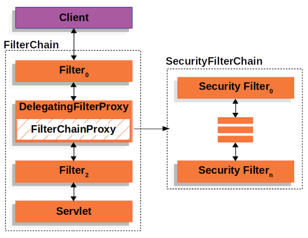

## 개요  
스프링 시큐리티(Spring Security)는 서블릿 스펙의 필터링(Filtering) 기술을 이용하고 있습니다. 그래서 필터의 개념을 알 필요가 있습니다. 서블릿 4에서는 필터에 대해 다음과 같이 설명합니다.

>A filter is a reusable piece of code that can transform the content of HTTP requests, responses, and header information. Filters do not generally create a response or respond to a request as servlets do, rather they modify or adapt the requests for a resource, and modify or adapt responses from a resource.

서블릿 스펙은 웹 기술을 정하는 것이므로 필터 역시 HTTP 요청과 응답을 처리하는 기능을 수행합니다. 다만 위의 설명에 있듯이 서블릿이 응답 자체를 새로 생성하는 것이라면 필터는 그렇게 생성된 응답을 변환하는 역할을 합니다. 들어오는 요청에 대해서도 그 요청이 컨트롤러에 도달하기 전에 개입하여 어떤 기능을 수행할 수 있습니다.

참고로 사용자 요청에 대해 "인바운드(inbound)", "다운스트림(downstream)"이라는 표현을 사용하고 반대로 서버에서 리턴되는 응답에 대해 "아웃바운드(outbound)", "업스트림(upstream)"이라는 용어를 사용합니다.

## Filter, FilterChain
필터의 가장 중요한 특징은 다수의 필터들을 순서대로 거치는 필터 "체인"으로 동작시킬 수 있다는 것입니다. `Filter` 인터페이스는 `doFilter(ServletRequest request, ServletResponse response, FilterChain chain)`라는 메소드를 실행하여 해당 필터의 기능을 수행하고 다시 `FilterChain` 인터페이스의 `doFilter(ServletRequest request, ServletResponse response)`을 호출하여 다음 필터의 `doFilter`를 실행하는 식으로 "chaining" 되어 있습니다.  

```
public void doFilter(ServletRequest request, ServletResponse response, FilterChain chain) {
   // do something before the rest of the application
   chain.doFilter(request, response); // invoke the rest of the application
   // do something after the rest of the application
}
```
스프링 시큐리티 공식 문서에 이러한 필터 기술을 어떻게 이용하고 있는지 잘 설명되어 있습니다. 스프링 프레임워크의 `DelegatingFilterProxy`라는 필터를 사용하여 시큐리티의 `FilterChainProxy`라는 빈에게 그 역할을 위임하고 이것은 다시 시큐리티가 제공하는 "Security filter chain"을 구동하도록 되어 있습니다. 공식 문서의 그림을 그대로 인용해보겠습니다.



Security filter chain은 여러 개의 보안 필터들로 구성되어 다양한 보안 관련 기능들을 개발자에게 제공합니다.

```
Security filter chain: [
  DisableEncodeUrlFilter
  WebAsyncManagerIntegrationFilter
  SecurityContextPersistenceFilter
  HeaderWriterFilter
  CsrfFilter
  LogoutFilter
  UsernamePasswordAuthenticationFilter
  DefaultLoginPageGeneratingFilter
  DefaultLogoutPageGeneratingFilter
  BasicAuthenticationFilter
  RequestCacheAwareFilter
  SecurityContextHolderAwareRequestFilter
  AnonymousAuthenticationFilter
  SessionManagementFilter
  ExceptionTranslationFilter
  FilterSecurityInterceptor
]
```
공식 문서의 설명을 인용합니다.

>The Security Filters are inserted into the FilterChainProxy with the SecurityFilterChain API. Those filters can be used for a number of different purposes, like authentication, authorization, exploit protection, and more. 

보안 필터들의 순서는 아래 코드를 참고하면 되겠습니다(알고 싶다면).

[FilterOrderRegistration](https://github.com/spring-projects/spring-security/blob/5.8.12/config/src/main/java/org/springframework/security/config/annotation/web/builders/FilterOrderRegistration.java)

[처음](../README.md) | [다음](../02/README.md)