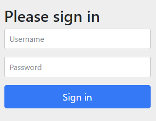

## 스프링 시큐리티 설정
앞에서 설명한 것처럼 우선 `DelegatingFilterProxy` 필터를 추가해야 합니다. 고전적인 방식의 `web.xml`에는 아래와 같이 필터를 설정하게 될 것입니다. 필터의 이름은 반드시 `springSecurityFilterChain`으로 해야 스프링 시큐리티의 보안 필터들을 활성화 할 수 있습니다.

```
<filter>
    <filter-name>springSecurityFilterChain</filter-name>
    <filter-class>org.springframework.web.filter.DelegatingFilterProxy</filter-class>
</filter>

<filter-mapping>
    <filter-name>springSecurityFilterChain</filter-name>
    <url-pattern>/*</url-pattern>
</filter-mapping>
```

이 예제에서는 `web.xml`을 <b>사용하지 않고</b> `AbstractAnnotationConfigDispatcherServletInitializer`와 `@Configuration` 구성 클래스로 스프링을 설정합니다. 이에 대한 자세한 설명은 [여기](https://github.com/boyd-dev/demo-mvc/tree/main/docs/05)를 참고하세요. 따라서 시큐리티 설정도 구성 클래스를 사용할 것입니다.

스프링 시큐리티의 보안 필터를 활성화시키는 것은 아래와 같은 짧은 클래스로 대체하게 됩니다(존재하면 자동으로 부트스트랩 됩니다). 

```
import org.springframework.security.web.context.AbstractSecurityWebApplicationInitializer;

public class MyWebSecurityInitializer extends AbstractSecurityWebApplicationInitializer{
}
```
`AbstractSecurityWebApplicationInitializer` 클래스의 API 설명을 인용합니다. `DelegatingFilterProxy`가 등록하는 시큐리티의 필터들은 다른 필터들 보다 앞에 배치되기 때문에 항상 먼저 실행됩니다.

>Registers the DelegatingFilterProxy to use the springSecurityFilterChain before any other registered Filter. 

`DelegatingFilterProxy` 필터는 실제 필터의 역할을 수행하는 시큐리티 "필터 빈"들을 실행합니다. 서블릿 컨테이너는 보통 필터들을 먼저 생성하기 때문에 `DelegatingFilterProxy`가 먼저 등록되고 나중에 컨텍스트 로더에 의해 시큐리티 필터 빈들이 로드될 수 있습니다.

>Another benefit of DelegatingFilterProxy is that it allows delaying looking Filter bean instances. This is important because the container needs to register the Filter instances before the container can startup. However, Spring typically uses a ContextLoaderListener to load the Spring Beans which will not be done until after the Filter instances need to be registered.

다음에는 구성 클래스로 세부적인 설정을 합니다. 스프링 시큐리티 구성 클래스는 `@EnableWebSecurity` 어노테이션을 사용합니다. `debug = true`는 개발과정에서 보안 필터의 실행을 자세히 보기 위함입니다.

```
@Configuration
@EnableWebSecurity(debug = true)
public class SecurityConfig {

}
```

참고로 `WebSecurityConfigurerAdapter`를 사용하여 구성 클래스를 작성하는 것은 [deprecated](https://spring.io/blog/2022/02/21/spring-security-without-the-websecurityconfigureradapter) 되었습니다.

이렇게 작성된 시큐리티 구성 클래스는 `AbstractAnnotationConfigDispatcherServletInitializer`을 상속한 클래스의 `getServletConfigClasses`에 추가합니다.

```
public class MyWebInitializer extends AbstractAnnotationConfigDispatcherServletInitializer {

	@Override
	protected Class<?>[] getRootConfigClasses() {
		return null;
	}

	@Override
	protected Class<?>[] getServletConfigClasses() {
		return new Class<?>[] {
			WebConfig.class,
			SecurityConfig.class // Security config	
			AppConfig.class	
		};
	}
   ...
}
```
여기서 눈여겨 볼 것은 시큐리티 구성 클래스는 `getServletConfigClasses`에서 리턴해주는 것으로 합니다. 스프링 MVC의 컨텍스트는 보통 [두 개로 나누어져](https://github.com/boyd-dev/demo-mvc/blob/main/docs/04/README.md) 있는데, 시큐리티의 빈들은 서블릿 컨텍스트가 있는 웹 컨텍스트에 배치하는 것을 [권장](https://docs.spring.io/spring-security/reference/5.8/servlet/configuration/java.html#abstractsecuritywebapplicationinitializer-with-spring-mvc
)하고 있기 때문입니다.

>The reason for this is that Spring Security needs to be able to inspect some Spring MVC configuration in order to appropriately configure underlying request matchers, so they need to be in the same application context. Placing Spring Security in getRootConfigClasses places it into a parent application context that may not be able to find Spring MVC’s HandlerMappingIntrospector.

또 한가지 고려할 것은 스프링 시큐리티 5.8 이후 버전에서는 컨텍스트 공유가 안되거나 `springSecurityFilterChain`을 찾을 수 없다는 [버그](https://github.com/spring-projects/spring-security/issues/14636)가 있기 때문에 서블릿 컨텍스트인 `getServletConfigClasses`에 서비스와 레포지토리 빈들을 모두 배치하도록 하겠습니다.

## HTTP 기본 인증  
단지 `SecurityConfig` 클래스만 만들고 빈 정의를 하나도 하지 않아도 모든 요청에 대해 HTTP 기본 인증(아이디와 패스워드)이 적용됩니다. 즉 위의 설정만 해도 아이디 패스워드 폼(form) 로그인이 활성화됩니다.



이것은 아래와 같이 `SecurityFilterChain`을 리턴하는 빈을 정의한 것과 동일합니다.
```
@Configuration
@EnableWebSecurity(debug = true)
public class SecurityConfig {

    @Bean
    public SecurityFilterChain filterChain(HttpSecurity http) throws Exception {
        http.authorizeHttpRequests((authorize) -> authorize.anyRequest().authenticated())
            .httpBasic(Customizer.withDefaults())
            .formLogin(Customizer.withDefaults());
		
        return http.build();
    }
}
```
이 코드는 약간 복잡해 보이지만 시큐리티 설정이 어떻게 이루어지는지 잘 보여주고 있습니다("람다 DSL"이라고 하는 방식).  

인자로 전달받는 `HttpSecurity` 클래스는 과거 `web.xml`에서 security 네임스페이스의 `<security:http>`에 해당하는 것이라고 생각하면 되겠습니다. 앞서 그림에서 `FilterChainProxy`라는 빈이 중간에서 시큐리티의 각 필터 빈들에게 역할을 위임하는 구조인데, `FilterChainProxy`을 직접 설정하는 대신 `HttpSecurity`을 사용합니다.  

`FilterChainProxy`의 API [설명](https://docs.spring.io/spring-security/site/docs/5.8.x/api/org/springframework/security/web/FilterChainProxy.html)은 아래와 같습니다.  

>Delegates Filter requests to a list of Spring-managed filter beans. As of version 2.0, you shouldn't need to explicitly configure a FilterChainProxy bean in your application context unless you need very fine control over the filter chain contents. Most cases should be adequately covered by the default <security:http /> namespace configuration options.

`HttpSecurity` 클래스의 메소드들은 많기 때문에 [API 문서](https://docs.spring.io/spring-security/site/docs/5.8.x/api/org/springframework/security/config/annotation/web/builders/HttpSecurity.html)를 참조하는 것이 좋습니다. 

위의 코드를 간단히 설명하면 아래와 같습니다.

- `authorizeHttpRequests`   
HTTP 요청에 대해 어떤 제약을 두고 싶을 때 사용합니다. 이 메소드는 [`Customizer<T>`](https://docs.spring.io/spring-security/site/docs/5.8.x/api/org/springframework/security/config/Customizer.html)라는 제너릭 함수형 인터페이스를 인자로 받습니다. 따라서 위의 코드처럼 람다 표현식을 전달할 수 있습니다.  
`Customizer<T>`는 인자로 전달받는 타입 T 객체를 설정(customizations)하는 역할을 합니다. 여기서는 `AuthorizationManagerRequestMatcherRegistry` 타입을 인자로 받는데, 이것을 설정하는 것이라고 보면 되겠습니다. 이름에서 알 수 있는 것처럼 HTTP 요청에 따라 허용 또는 차단 등의 규칙을 정하는 것이라고 생각할 수 있습니다.  
`authorize.anyRequest().authenticated()`은 모든 요청이 인증을 받아야 한다는 것을 의미합니다. 즉 로그인을 거쳐야 시큐리티의 보안 필터를 통과할 수 있습니다. `Customizer<AuthorizeHttpRequestsConfigurer.AuthorizationManagerRequestMatcherRegistry>`는 리턴 없이 `AuthorizationManagerRequestMatcherRegistry`으로 이어지기 때문에 원하는 설정을 계속 추가할 수 있습니다. 예를 들어 정적 컨텐츠가 있는 URL 경로 `/resources/**`에 대해서 모든 요청을 허용하고 나머지는 인증을 거치도록 하고 싶다면 아래와 같이 하면 되겠습니다.  
   ```
   http.authorizeHttpRequests((authorize) -> authorize
			.requestMatchers(new String[]{"/resources/**"}).permitAll()				
			.anyRequest().authenticated())
   ```

- `httpBasic`  
HTTP 기본 인증(아이디와 패스워드)을 수행합니다. 이것 역시 `Customizer<T>`라는 제너릭 함수형 인터페이스를 인자로 받습니다. 그런데 `Customizer`는 static 메소드로 `withDefaults`를 가지는데 이것은 전달 인자를 디폴트 설정으로 사용 하겠다는 의미입니다.  

- `formLogin`  
아이디와 패스워드를 입력받을 수 있는 기본 화면을 설정합니다. 마찬가지로 인자로 전달되는 `FormLoginConfigurer`의 설정을 변경하여 화면과 로그인 처리를 원하는대로 바꿀 수 있습니다. 여기서는 `withDefaults`로 디폴트 설정을 그대로 유지합니다.

마지막에 `http.build()`으로 `SecurityFilterChain`을 리턴하면 설정이 완료됩니다. 정리하면 위의 빈 설정은 모든 인바운드 요청에 대해 아이디 패스워드 로그인 기반의 HTTP 기본 인증을 사용하겠다는 의미가 되겠습니다. 

## CSRF 필터
잘 알려진 해킹 공격 중 하나로 CSRF(Cross Site Request Forgery)가 있습니다. 이것은 이미 인증을 받은 정상 사용자가 자신도 모르게 공격자가 심어놓은 요청을 보내면서 공격자가 의도한 요청이 서버에서 실행되도록 하는 해킹 기법입니다. 서버는 이 요청이 이미 인증을 받은 사용자가 보내는 요청이라고 판단하기 때문에 그대로 실행합니다.  

이 문제를 방지하기 위해서 사용자가 보내는 요청마다 서버 측에서 발급한 어떤 값(1회용 토큰)을 함께 보내도록 합니다. 서버는 받은 토큰이 일치하지 않는 요청은 CSRF일 수 있기 때문에 차단합니다.

스프링 시큐리티의 필터 체인에는 기본적으로 `CsrfFilter`가 활성화되어 있고 `CsrfTokenRequestAttributeHandler`에 의해 토큰을 속성에 추가 합니다. 따라서 아래와 같이 HTML 파일에 해당 토큰을 저장해서 서버로 요청을 보낼 때 자동으로 포함시켜 보낼 수 있습니다. `Thymeleaf`의 경우 아래와 같이 view 페이지에 자동으로 `_csrf`이라는 hidden 속성이 추가됩니다.

```
<form method="post" th:action="@{'/home'}">
    <input type="submit"/>   
</form>
```
위의 코드는 아래와 같이 변환됩니다.
```
<form method="post" action="/demo-mvc/home">
	<input type="hidden" name="_csrf" value="7228a6ee-ccbd-4a6c-a473-ec4a83c030b5">
	<input type="submit"/>   
</form>    
```

## 다른 인증 방식
이제까지 HTTP 기본 인증을 예로 들어 스프링 시큐리티의 설정을 간단하게 알아보았습니다. 시큐리티가 제공하는 인증 방식은 아이디와 패스워드 방식 외에도 [여러 가지](https://docs.spring.io/spring-security/reference/5.8/servlet/authentication/index.html#servlet-authentication-mechanisms)가 있습니다. 어떤 인증 방식을 선택하느냐에 따라 해당 매뉴얼을 잘 읽어보고 적용할 필요가 있겠습니다. 공식 문서를 그대로 옮겨보면 아래와 같습니다. 

- Username and Password - how to authenticate with a username/password

- OAuth 2.0 Login - OAuth 2.0 Log In with OpenID Connect and non-standard OAuth 2.0 Login (i.e. GitHub)

- SAML 2.0 Login - SAML 2.0 Log In

- Central Authentication Server (CAS) - Central Authentication Server (CAS) Support

- Remember Me - how to remember a user past session expiration

- JAAS Authentication - authenticate with JAAS

- OpenID - OpenID Authentication (not to be confused with OpenID Connect)

- Pre-Authentication Scenarios - authenticate with an external mechanism such as SiteMinder or Java EE security but still use Spring Security for authorization and protection against common exploits.

- X509 Authentication - X509 Authentication


[처음](../README.md) | [다음](../04/README.md)