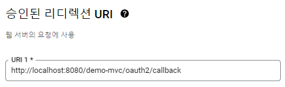
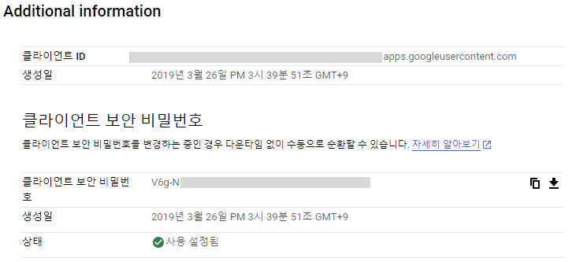
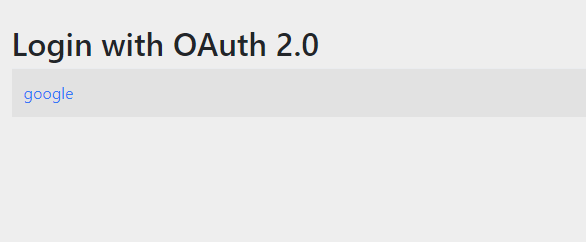

## OAuth2 로그인 설정
우선 앞서 아이디 패스워드 기본 인증 설정이 OAuth2Login에서는 어떻게 변하는지 보겠습니다.

```
http.authorizeHttpRequests((authorize) -> authorize
				.requestMatchers(new String[]{"/resources/**"}).permitAll()
				.anyRequest().authenticated())
			.httpBasic(Customizer.withDefaults())
			.formLogin(Customizer.withDefaults());
```
OAuth2Login에서는 아래와 같이 변경됩니다.

```
http.authorizeHttpRequests((authorize) -> authorize
				.requestMatchers(new String[]{"/resources/**"}).permitAll()
				.anyRequest().authenticated())		
		    .oauth2Login(oauth2 -> ...);

```

기본 인증을 사용하는 `formLogin`이 `oauth2Login`으로 대체되고 시큐리티의 람다 DSL 방식의 설정이 이어지는 형태로 사실상 크게 달라지는 것은 없습니다. `oauth2Login` 역시 `Customizer(OAuth2LoginConfigurer)`를 인자로 하기 때문에 람다 표현식으로 필요한 설정을 계속 이어 갈 수 있습니다. 

스프링 시큐리티에서 OAuth 2를 활성화시키면 아래와 같은 두 개의 필터가 자동으로 시큐리티 필터 체인에 추가됩니다.

```
OAuth2AuthorizationRequestRedirectFilter
OAuth2LoginAuthenticationFilter
```

이제부터 하나씩 설정을 해보겠습니다.

## clientRegistrationRepository
`ClientRegistration`에 대해 공식문서의 [설명](https://docs.spring.io/spring-security/reference/5.8/servlet/oauth2/client/core.html#oauth2Client-client-registration)을 인용합니다. 

>ClientRegistration is a representation of a client registered with an OAuth 2.0 or OpenID Connect 1.0 Provider.

말 그대로 구글이나 네이버처럼 사용자 정보를 가지고 있는 "Authorization Server"에 대한 정보를 말합니다. 즉 사용자 정보에 대한 접근 허가권을 얻기 위해서는 구글 같은 "OAuth 2.0 Provider"에게 허가권을 요청해야 하고 이를 위해서는 미리 구글 쪽에 사전 작업을 해야 합니다. 그리고 이에 대한 정보를 바탕으로 Access Token을 받을 수 있게 되는 것입니다. 

이 예제에서는 구글을 기준으로 합니다. 아래 구글 클라우드에 접속하여 사용자 인증정보 > OAuth 2.0 클라이언트 ID 메뉴에서 관련 정보를 등록할 수 있습니다.

https://console.developers.google.com

여기서 가장 중요한 부분은 "승인된 리디렉션 URI"입니다.



OAuth 2의 "Authorization Code Grant" 흐름을 다시 떠올려 보면, 구글 로그인을 성공한 후에, 구글은 설정된 "리디렉션 URI"로 Access Token을 발급받을 수 있는 "Authorization Code"을 보내도록 되어 있습니다. 당연히 이것을 받는 쪽은 내가 만든 애플리케이션("Client"가 됩니다)이 되어야 하므로 `http://localhost:8080/demo-mvc/oauth2/callback`으로 설정합니다.  

구글은 이와 함께 "Client"를 식별할 수 있는 "클라이언트 ID"와 "클라이언트 보안 비밀번호"를 발급합니다. 



그런데 구글 외에도 "OAuth 2.0 Provider"들은 많이 있습니다. 따라서 이러한 정보들을 모아놓은 저장소가 있어야 하는데 이것이 바로 `ClientRegistrationRepository`입니다. 아래 코드를 보면 이해하기 쉬울 것입니다. `ClientRegistrationRepository` 빈을 다음과 같이 만들 수 있습니다. 

```
@Bean
public ClientRegistrationRepository clientRegistrationRepository() {
		
	ClientRegistration google = ClientRegistration.withRegistrationId("google")
		.clientId(env.getProperty("google.clientId"))
		.clientSecret(env.getProperty("google.clientSecret"))
		.authorizationGrantType(AuthorizationGrantType.AUTHORIZATION_CODE)
		.authorizationUri(env.getProperty("google.authorizationUri"))		    
		.tokenUri(env.getProperty("google.accessTokenUri"))
		.redirectUri(env.getProperty("google.redirectUri"))
		.scope(env.getProperty("google.scope").split(","))
		.userInfoUri(env.getProperty("google.userInfoUri"))
		.userNameAttributeName("name")
		.build();
		
	InMemoryClientRegistrationRepository clientRegisterationRepository = new InMemoryClientRegistrationRepository(new ClientRegistration[] {google});
	return clientRegisterationRepository;
}

```

스프링 시큐리티는 `ClientRegistrationRepository` 구현체로 `InMemoryClientRegistrationRepository`를 제공합니다. 이것은 `ClientRegistration`을 배열로 전달 받습니다. 따라서 구글 외에도 여러 인증 공급자를 추가할 수 있습니다. 각 공급자들은 `withRegistrationId("google")`에서 지정한 아이디로 구분할 수 있습니다.  

참고로 시큐리티는 [`CommonOAuth2Provider`](https://docs.spring.io/spring-security/site/docs/5.8.x/api/org/springframework/security/config/oauth2/client/CommonOAuth2Provider.html)에서 4개의 공급자를 프리셋 형태로 제공하므로 이것을 이용해도 되겠습니다.  

이 예제에서는 직접 설정합니다. 관련 정보들은 `oauth2.properties` 파일로 분리시켜서 빈에서 참조하도록 했습니다. 이렇게 정의된 빈은 다음과 같이 사용할 수 있습니다.  

```
@Bean
public SecurityFilterChain filterChain(HttpSecurity http) throws Exception {
		
		http.authorizeHttpRequests((authorize) -> authorize
				.requestMatchers(new String[]{"/resources/**"}).permitAll()
				.anyRequest().authenticated()
			 )		
		    .oauth2Login(oauth2 -> oauth2.clientRegistrationRepository(clientRegistrationRepository())

                 ...
		    
		     );
		    
		return http.build();
}
```

## redirectionEndpoint
구글에서 인증이 성공하면 "승인된 리디렉션 URI"으로 "Authorization Code"를 보내주는데 스프링 시큐리티 필터가 이 요청을 처리할 수 있도록 해주어야 합니다. 이것을 설정하는 것이 `redirectionEndpoint`입니다. 당연히 구글에 설정한 경로와 동일해야 합니다.

```
.oauth2Login(oauth2 -> oauth2.clientRegistrationRepository(clientRegistrationRepository())
		    .redirectionEndpoint(redirect -> redirect.baseUri("/oauth2/callback"))
...
)
```
설정하지 않으면 기본 값이 적용되지만 구글 설정도 여기에 맞추는 것을 잊지 말아야 합니다. 자세한 설명은 [여기](https://docs.spring.io/spring-security/reference/5.8/servlet/oauth2/login/advanced.html#oauth2login-advanced-redirection-endpoint)를 참조하세요.


## OAuth2UserService
구글이 "승인된 리디렉션 URI"로 보내주는 것은 아래와 같이 URI에 따라오는 query string 형태입니다.

```
http://localhost:8080/demo-mvc/oauth2/callback?state=Ypvf...PF2g&code=4/0AeaYSHA...P8m_OoOdPAZEQ&scope...

```
"Authorization Code"에 해당하는 것은 `code=4/0AeaYSHA...`입니다. 따라서 이렇게 콜백된 요청에서 `code`값을 가지고 Access Token을 다시 요청해야 합니다. 물론 직접 HTTP 요청을 만들어도 되겠지만 시큐리티에서 이것을 자동으로 해주기 때문에 추가적인 작업이 필요 없습니다.  

시큐리티가 제공하는 [`DefaultOAuth2UserService`](https://docs.spring.io/spring-security/site/docs/5.8.x/api/org/springframework/security/oauth2/client/userinfo/DefaultOAuth2UserService.html)는 Access Token을 받은 후 그것을 이용하여 실제 사용자 정보를 요청하고 `OAuth2User` 객체에 저장하는 기능을 수행합니다. 내부적으로 `RestTemplate`을 이용하여 `ClientRegistration.userInfoUri`으로 실제 사용자 정보를 요청합니다.

좀더 명확한 처리과정을 보기 위해 이것을 상속하는 빈을 만들어서 설정해보겠습니다. 

```
public class MyOAuth2UserService extends DefaultOAuth2UserService {
	
	@Override
	public OAuth2User loadUser(OAuth2UserRequest userRequest) throws OAuth2AuthenticationException {
	
		logger.info(userRequest.getClientRegistration().getRegistrationId());
		
		OAuth2User user = super.loadUser(userRequest);	
		
		user.getAttributes().forEach((k,v)-> System.out.println(k + "=" + v));
		user.getAuthorities().forEach(grantedAuth -> System.out.println(grantedAuth));
		return user;
	}
}
```
`DefaultOAuth2UserService`의 기능을 그대로 이용하면서 `loadUser`만을 오버라이드했습니다. 이렇게 해서 구글에서 전송된 사용자 정보와 시큐리티가 추가한 정보들을 출력해볼 수 있습니다.

```
sub=100...
name=J.S. Kim
given_name=J.S.
family_name=Kim
picture=https://lh3.googleusercontent.com/...
email=...@gmail.com
email_verified=true
locale=en

ROLE_USER
SCOPE_https://www.googleapis.com/auth/userinfo.email
SCOPE_https://www.googleapis.com/auth/userinfo.profile
SCOPE_openid
```

아이디 패스워드 인증에서는 사용자 정보를 구성하는 항목들을 하나로 통일할 수 있었지만 OAuth 2를 이용하는 인증에서는 각 서비스마다 표현 방식이 다르므로 별도의 작업이 필요할 수 있습니다. 스프링 시큐리티에서는 아이디에 해당하는 것을 `ClientRegistration.userNameAttributeName`으로 설정해서 `name` 속성으로 참조할 수 있도록 했습니다. 여기서는 구글의 사용자 정보 항목 중 `name`에 매핑하기로 합니다(하지만 아이디로 사용하기 때문에 유일해야 하므로 `email` 같은 것으로 매핑하는 것이 좋습니다).

최종적으로 `oauth2Login`의 기본적인 최소 설정은 아래와 같은 형태가 됩니다. 

```
@Bean
public SecurityFilterChain filterChain(HttpSecurity http) throws Exception {
		
	http.authorizeHttpRequests((authorize) -> authorize
			.requestMatchers(new String[]{"/resources/**"}).permitAll()
			.anyRequest().authenticated()
		 )		
	    .oauth2Login(oauth2 -> oauth2.clientRegistrationRepository(clientRegistrationRepository())
		    	.redirectionEndpoint(redirect -> redirect.baseUri("/oauth2/callback"))
		    	.userInfoEndpoint(user -> user.userService(oauth2UserService()))
		    	
		);
		
	return http.build();
}
```

이렇게 저장된 사용자 정보는 이후 컨트롤러에서 `Authentication` 객체로 참조할 수 있습니다.
```
@RequestMapping(value = {"/", "/home"}, method = {RequestMethod.GET, RequestMethod.POST})
public String home(Locale locale, Model model, Authentication auth) {
		
		logger.info("{} logged in.", auth.getPrincipal());
		
		...
		
		return "home";
}

```
아이디 패스워드 인증의 `UserDetailsService`와 마찬가지로 `OAuth2UserService` 인터페이스를 구현한 커스텀 클래스로 대체해서 사용자 정보를 나의 애플리케이션에 맞게 구성할 수 있을 것입니다.  

앞서 언급한 것처럼 `oauth2Login`은 단순히 인증을 위해 OAuth 2를 이용하는 것이므로 인증된 사용자를 "Client" 애플리케이션에서 어떻게 사용자로 등록시키고 부가적인 정보를 구성할 것이냐는 설계 방향에 따라 다를 수 있습니다. OAuth 2 공급자에게 지속적으로 사용자 정보를 요청해야 한다면 `oauth2Client`를 적극적으로 이용할 수도 있을 것입니다. 이 경우에는 Refresh Token을 활용할 필요가 있습니다. 이에 대한 방법은 [문서](https://docs.spring.io/spring-security/reference/5.8/servlet/oauth2/client/index.html)를 참조하세요.

시큐리티가 제공하는 기본 로그인 화면은 아래와 같은 형태입니다. `http://localhost:8080/demo-mvc/login`으로 접속하면 되겠습니다(물론 커스텀 로그인 화면으로 대체 가능합니다). 



이 예제에서는 디폴트 로그아웃 URL을 변경하고 로그아웃 후에는 구글에서 발급한 Access Token을 폐기(revoke)하는 로직을 추가하였습니다. 전체 소스는 [여기](https://github.com/boyd-dev/demo-security/tree/main/example/demog-oauth2)를 참조하기 바랍니다.


[처음](../README.md)
