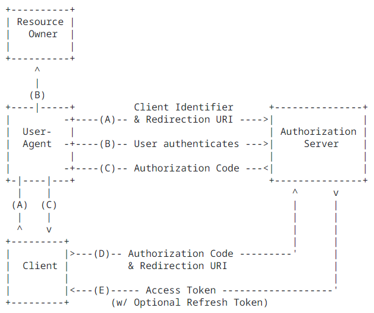

## OAuth2 인증에 관한 오해

### OAuth2의 사실과 오해 또는 안티 패턴?

소셜 로그인 기능을 구현할 때 등장하는 OAuth2는 자주 언급되지만 그만큼 잘못 이해할 수 있는 부분들이 많은 것 같아서 정리했습니다. 이 글에서는 이와 관련된 문제들을 표준과 공식문서를 기준으로 확인하려는 목적으로 작성되었습니다. 

우선 인증(Authentication)과 인가(Authorization)을 구분하는 것으로 이야기를 시작해보겠습니다. 

### 인증과 인가는 다른 것인가?

OAuth2의 [표준](https://datatracker.ietf.org/doc/html/rfc6749)은 아래와 같이 시작합니다.

>The OAuth 2.0 authorization framework enables a third-party application to obtain limited access to an HTTP service, either on behalf of a resource owner by orchestrating an approval interaction between the resource owner and the HTTP service, or by allowing the third-party application to obtain access on its own behalf.

OAuth2는 "인가 프레임워크(authorization framework)"입니다.  

상식적인 이야기지만 인증은 사용자의 신분을 확인하는 것이고, 인가는 그렇게 확인된 사용자가 어떤 권한을 가지고 있는지를 결정하는 일입니다. 보통 인증 후에 인가에 대한 처리가 이루어집니다. 앞서 말할 것처럼 OAuth2는 인증이 아닌 인가에 관한 표준입니다. 

그래서 OAuth2 자체는 소셜 로그인과 무관한 표준이라고 할 수 있습니다. 위에 인용한 표준에도 있는 것처럼 제3자 애플리케이션이 사용자의 허가를 받아 다른 서버(리소스 서버)가 보유한 사용자 정보에 접근하기 위한 용도입니다. 예를 들어 내가 만든 foo라는 애플리케이션이 구글에 있는 어떤 사용자 정보에 접근하기 위해 그 사용자에게 인가를 받는 과정을 다루는 것입니다. 사용자와 구글의 관계에서 보면 foo는 제3자가 됩니다.

그렇다면 OAuth2의 어떤 부분이 인증과 관련되어 있을까요? 제3자 애플리케이션이 사용자의 허가를 받기 위해서는 사용자가 직접 구글에 로그인하여 그것을 허용해야 합니다. 앞서 언급했듯이 사용자 인증을 통과해야 인가를 받을 수 있는 것입니다. 인증을 어떤 방식으로 하느냐는 사실 OAuth2의 관심사가 아닙니다. 인증 방식이 단순히 아이디-패스워드 방식일 수도 있고 모바일 기기를 통한 인증일 수도 있습니다. 제3자 애플리케이션은 바로 이 부분을 이용하여 인증의 근거로 삼는 것입니다. foo는 사용자의 인증을 구글에 의존하는 셈입니다. 더구나 구글에 있는 사용자 정보에도 접근 가능하므로 직접 사용자 정보를 입력받지 않아도 됩니다(또는 가입절차 간소화).

OAuth2에 등장하는 주체들은 각각 역할이 있습니다. 표준에는 아래와 같은 네 가지 역할이 도식화 되어 있습니다. 

네 가지 [역할](https://datatracker.ietf.org/doc/html/rfc6749#section-1.1)은 아래와 같습니다(구글을 예로 들면).

- Resource Owner = 사용자
- Resource Server = 구글(사용자 정보)
- Client = foo(제3자 애플리케이션, 내가 만드는 애플리케이션)
- Authorization Server = 구글(토큰 발급)

위의 도식에서 대표적인 오해 중 하나는 바로 클라이언트 "Client" 입니다. 

### OAuth2에서 말하는 "클라이언트(Client)"는 사용자(프론트엔드)일까, 서버(백엔드)일까?

OAuth2의 클라이언트는 아래와 같이 설명되어 있습니다.

>client  
An application making protected resource requests on behalf of the resource owner and with its authorization. The term "client" does not imply any particular implementation characteristics (e.g., whether the application executes on a server, a desktop, or other devices).

클라이언트는 서버에서 실행되는 애플리케이션 또는 데스크탑과 같은 다른 장치에서 실행되는 프로그램을 의미합니다. 그러니까 통상적으로 "클라이언트"라고 하면 "서버는 아니지"라고 생각하거나 "사용자"를 떠올리는데 그것은 잘못된 이해입니다. OAuth2에서 사용자는 "Resource Owner"이고 클라이언트는 "foo"가 됩니다.

그런데 데스크탑에서 실행되는 웹 브라우저를 클라이언트 애플리케이션으로 볼 수도 있지 있을까요? 생각해보면 프론트엔드 애플리케이션이 클라이언트의 역할을 할 수도 있을 것 같습니다. 하지만 프론트엔드가 클라이언트가 되면 소셜 로그인 구현에서 여러 가지 다른 문제들이 발생합니다. 구글을 예로 들면

- 구글로부터 액세스 토큰을 요청하거나 또는 직접 사용자 정보를 조회할 때 CORS 문제가 발생할 수 있습니다(Authorization, Resource 서버는 구글이 운영합니다). 
- 백엔드에서 사용자 정보를 조회하려면 프론트엔드는 매번 액세스 토큰을 넘겨주고 백엔드는 이것을 가지고 구글로부터 사용자 정보를 조회해야 합니다. 
- 백엔드에서 사용자의 인증 여부를 검사하려면 프론트엔드로부터 액세스 토큰을 넘겨받아 매번 구글에 그 유효성을 확인받아야 합니다. 결국 모든 요청에 대해 구글에게 액세스 토큰의 유효성을 확인해야 한다는 말이 됩니다.

액세스 토큰은 제3자인 foo가 구글의 리소스 서버에서 사용자 정보를 조회하기 위한 용도입니다. foo의 사용자가 foo에 로그인을 했는지, foo의 어떤 리소스를 사용할 수 있는지 여부를 판별하는 용도로 발급된 것이 아닙니다. 

잘못된 접근은 상황을 점점 더 복잡하게 만드는데, 액세스 토큰은 유효시간이 1-2시간으로 정해져 있기 때문에 만료되기 전에(또는 만료되면) 리프레시 토큰을 이용하여 다시 액세스 토큰을 재발급 받는 로직을 추가하기도 합니다. 그러나 이 경우에도 프론트엔드가 리프레시 토큰을 보관하고 있다면 백엔드에서 액세스 토큰의 만료가 확인될 때 프론트엔드에게 리프레시 토큰을 다시 요청해야 합니다. 

리프레시 토큰을 미리 백엔드에 보관해두면 어떨까요? 그렇게 되면 사실상 프로트엔드, 백엔드 양쪽 아니면 차라리 백엔드에만 리프레시 토큰을 보관하는 편이 낫고 대신 액세스 토큰에 대응되는 리프레시 토큰 정보를 저장해야 합니다. 만약 리프레시 토큰으로 새로운 액세스 토큰을 받았다면 웹 브라우저에 저장된 액세스 토큰도 갱신시켜주어야 합니다. 본질적으로 이 토큰은 foo와 사용자 사이의 인증 또는 인가와는 목적이 다르므로 여전히 이상하기만 합니다. 

나중에 다루겠지만 토큰 기반 인증은 위와 같은 흐름과 유사합니다. <b>그러나 여기서 말하는 토큰들은 foo가 발행한 토큰이 아니라 구글과 같은 OAuth2 서비스 제공자가 발행한 토큰들이고 외부 API 호출을 계속해야 한다는 점에서 큰 차이가 있습니다. 구글 외에 다른 소셜 로그인이 추가되면 더 복잡해질 것입니다.</b> 

요약하면 OAuth2의 클라이언트는 백엔드(서버)를 의미합니다. 또 소셜 로그인 과정에서 발급된 액세스 토큰과 리프레시 토큰을 <b>그대로 사용하는 것은 부작용들이 생기고 다른 작업들이 늘어납니다.</b>  

### OAuth2 서비스 제공자의 리프레시 토큰 용도 

그렇다면 표준에서 OAuth2의 리프레시 토큰은 어떤 용도로 설명하고 있을까요? 물론 유효시간이 짧은 액세스 토큰이 만료되는 경우 새로운 액세스 토큰을 발급받기 위한 용도입니다. 최초의 리프레시 토큰은 액세스 토큰이 발급될 때 함께 주는 경우가 있습니다. 이때는 사용자가 발급 받지만(사용자는 "Authorization code"를 클라이언트에 넘겨주고 클라이언트가 요청할 수도 있습니다) 실제 리프레시 토큰을 사용하여 새로운 액세스 토큰을 발급받는 것은 클라이언트입니다. OAuth2 표준을 다시 보겠습니다.

"Refresh tokens are credentials used to obtain access tokens. Refresh tokens are issued to the client by the authorization server and are used to obtain a new access token when the current access token becomes invalid or expires, or..."

이렇게 되면 백엔드인 클라이언트에서 리프레시 토큰을 보관하는 것이 맞고 액세스 토큰 만료여부에 따라 새로운 액세스 토큰을 발급받는 주체도 클라이언트가 됩니다.  

구글의 OAuth2 관련 도움말 문서에는 리프레시 토큰에 대해 아래와 같이 [설명](https://developers.google.com/identity/protocols/oauth2/web-server#offline)하고 있습니다. 

>Refreshing an access token (offline access)  
Access tokens periodically expire and become invalid credentials for a related API request. You can refresh an access token without prompting the user for permission (including when the user is not present) if you requested offline access to the scopes associated with the token.

이 설명에 따르면 사용자가 오프라인일때 사용자의 재동의없이도 사용자 정보에 접근하기 위해 리프레시 토큰을 사용한다는 말입니다. 실제로 구글에게 액세스 토큰을 요청할 때 `access_type=offline`으로 설정해야 리프레시 토큰을 함께 주는데 여기서 `offline`의 의미가 바로 사용자가 오프라인 중에도 클라이언트가 액세스 토큰을 새로 발급받을 때 사용하라는 의미인 것입니다. 

결국 OAuth2 리프레시 토큰의 원래 용도는 사용자가 클라이언트인 foo를 사용하다가 액세스 토큰이 만료되어 재로그인해야 하는 불편함을 없애기 위한 것이라기 보다는 반대로 사용자가 오프라인일때 foo가 어떤 필요에 의해 사용자 정보에 접근하기 위한 용도라고 할 수 있습니다. 

어떻게 보면 오해의 소지가 다분합니다. 사용자가 재인증을 수행하는 번거로움을 방지한다는 말은 다시 로그인해서 액세스 토큰을 새로 발급받는 불편함을 줄이는 것으로 해석할 수 있습니다. 그러나 본질적으로, <b>사용자 동의를 미리 얻어 사용자가 없어도(오프라인) 사용자 정보에 접근할 수 있도록 하는 것과, 사용자가 온라인 상태에서 로그인 연장을 하는 것에는 분명히 차이가 있습니다.</b>  

### OAuth2 초기 인증 후 새로운 인증 토큰 발행

소셜 로그인은 처음 사용자의 가입 절차를 간소화하고 이미 다른 서비스(이를테면 구글) 이용자들이 쉽게 제3자 애플리케이션을 사용할 수 있도록 접근성을 높이려는 의도가 있습니다. 따라서 처음 액세스 토큰을 받아서 사용자 정보를 취득하고 나면 제3자 애플리케이션의 전용 인증/인가 토큰을 추가적으로 발급하는 것이 합리적입니다. 또 제3자 애플리케이션의 목적에 맞는 사용자 정보를 따로 만들어야 할 필요성도 당연히 있을 것입니다. 예를 들어 이메일과 같은 정보는 구글로부터 받을 수 있지만 foo가 사용자별로 제공하는 정보들은 foo만이 관리할 수 있습니다. 

새로운 토큰은 JWT의 포맷을 따르는 경우가 많습니다. 이때 JWT를 액세스 토큰과 리프레시 토큰 두개로 나누어 발행할 수 있습니다. 이 토큰들은 OAuth2 서비스 제공자의 그것과는 성격과 목적이 완전히 다릅니다. 맥락상 이 토큰들의 목적은 인증/인가 토큰과 동일하지만 차이가 있습니다. 액세스 토큰은 로그인 했음을 증명하는 인증 토큰이면서 동시에 해당 애플케이션의 리소스에 접근할 수 있는 인가 토큰의 역할도 할 수 있습니다. 리프레시 토큰은 만료시간을 늘려주기 위한 액세스 토큰 재발급용입니다. 이들 토큰은 내가 만드는 애플리케이션이 관리 합니다.

그러나 OAuth2 서비스 제공자의 토큰을 이러한 목적으로 사용하는 것은 토큰의 목적에도 맞지 않고 앞으로 살펴볼 JWT가 가져다 주는 많은 장점들도 이용하기 어렵습니다.

### 일반적인 토큰 기반의 인증에서 액세스 토큰과 리프레시 토큰

액세스 토큰과 리프레시 토큰이라는 용어는 토큰 기반의 인증에서 흔히 사용되는 용어입니다. 아마 용어가 같기 때문에 OAuth2 서비스 제공자의 토큰들을 토큰 기반 인증에서 활용할 수 있다고 잘못 이해하는 경우가 많을 것으로 짐작합니다. 

보통 토큰 기반의 인증에서는 토큰 포맷으로 JWT를 사용합니다. JWT를 사용하면 필요한 정보를 담을 수 있고(이것을 "self-contained"라고 말합니다) 토큰의 유효성을 전자서명으로 즉시 확인할 수 있기 때문에 소위 "Scalability" 측면에서 유리한 점이 있습니다. 

앞서 말한 것처럼 사용자 기본 정보 취득을 OAuth2 서비스로부터 하고 그 이후부터는 새로운 토큰을 발행하여 토큰 기반 인증으로 애플리케이션을 구성하는 것이 바람직합니다. 다시 한번 말하지만 용어가 같다는 이유로 이것을 OAuth2 서비스 제공자의 액세스, 리프레시 토큰과 동일한 것으로 뒤섞어 오용하기 시작하면 불필요한 안티 패턴을 양산할 수 있음을 주의할 필요가 있습니다.

OAuth2에서는 "Authorization Server"와 "Resource Server"가 물리적으로 다르다는 것을 전제합니다. 하지만 토큰 인증 기반에서는 꼭 그렇게 분리할 이유가 없습니다. 어차피 인증 토큰 발급과 사용 주체는 백엔드 하나이기 때문입니다. 따라서 두 서버의 역할, 발급한 토큰들의 정보들을 서버에서 관리해야 하고 전송된 토큰의 유효성을 검사할 필요도 있습니다.

토큰 기반 인증에서는 세션을 사용하지 않으므로 인증 토큰들을 브라우저의 저장소(쿠키 등)에 보관하게 됩니다. 다시 말해서 발행한 JWT를 어디에 보관할 것이냐는 문제도 결정해야 합니다. 또 백엔드 API 호출에서 JWT를 전송할 때 헤더의 `Authorization`에 넣거나("Bearer" 토큰이라고 합니다) 쿠키를 통해 자동으로 전송하게 하는 두 가지 방식이 있을 수 있습니다.  

쿠키는 모든 요청에 대해 자동으로 추가되어 전송되지만 Bearer 토큰은 HTTP 요청을 만들 때 헤더에 직접 넣어주어야 한다는 점에서 차이가 있습니다. Bearer 토큰이 범용적이기 때문에 API 호출의 경우 대부분 이 방식을 사용합니다. OAuth2에서도 액세스 토큰이나 사용자 정보를 받을 때도 Bearer 토큰 방식을 사용합니다. 

토큰 인증에서 리프레시 토큰을 도입하게 되면 로그인 후 처음 발행된 액세스 토큰의 만료시간보다 훨씬 긴 유효시간을 갖도록 하는 것이 일반적입니다. 왜냐하면 액세스 토큰이 유출되는 경우에 대비하여 몇 시간 내에 만료되도록 하고 대신 이것을 보완하기 위해 긴 만료시간을 지닌 리프레시 토큰을 추가하는 것입니다. 

리프레시 토큰 그 자체는 그냥 값 토큰이고 사용자에 관한 정보를 가지지 않습니다. 리프레시 토큰은 액세스 토큰을 재발급 받기 위한 용도이기 때문에 리프레시 토큰이 유출되더라도 액세스 토큰을 발급받으려면 부가적인 정보들이 필요하기 때문에 상대적으로 안전합니다.

액세스 토큰을 "리프레싱"하는 방식으로 두 가지 정도를 생각할 수 있습니다.  

- 액세스 토큰 만료 후 재발급
- 액세스 토큰 만료 전 재발급

상식적으로 첫 번째가 당연할 것 같지만 만료 시간을 매번 검사해서 곧 만료될 예정이면 사전에 갱신시켜 주는 방법이 사용자 경험 측면에서 좋을 수도 있습니다.

참고로 벨둥(Baeldung) 사이트에 토큰 기반 인증과 "Remember Me"를 결합한 [예제](https://www.baeldung.com/spring-security-oauth2-remember-me)가 있습니다. 리프레시 토큰을 활용하는 좋은 예제가 될 것 같습니다.

### 스프링 시큐리티의 oauth2Login

OAuth2의 원래 목적에 맞게 인증 처리를 지원해주는 라이브러리로 스프링 시큐리티의 `oauth2Login` 기능을 사용할 수 있습니다. 앞의 내용과도 맥락이 같습니다: OAuth2 서비스 제공자가 발행하는 액세스 토큰으로 인증 여부를 갈음합니다. 소셜 로그인의 역할은 여기까지입니다.

스프링 시큐리티의 공식 [문서](https://docs.spring.io/spring-security/reference/5.8/servlet/oauth2/login/index.html)에는 아래와 같이 나와있습니다.

>OAuth 2.0 Login is implemented by using the Authorization Code Grant, as specified in the OAuth 2.0 Authorization Framework and OpenID Connect Core 1.0.

`oauth2Login`는 OAuth2의 "Authorization Code Grant"와 "OpenID Connect Core"의 구현체입니다. 말 그대로 제3자 애플리케이션에게 사용자 정보 접근 "grant"를 주는 과정에서 발생하는 인증을 이용하는 것입니다.

OAuth2의 "Authorization Code Grant"는 다음과 같은 그림으로 설명되어 있습니다. 

위의 그림을 보면 클라이언트가 웹 브라우저가 아니라는 것을 좀 더 분명히 알 수 있습니다. 웹 브라우저에 해당하는 것은 "User Agent"입니다. 이 도식에 따르면 "Authorization Code"를 웹 브라우저가 받아서 다시 클라이언트에 전달하는데 스프링 시큐리티에서는 백엔드 서버가 직접 받아서 처리하는 부분이 약간 다릅니다. 사실 OAuth2의 간접적인 인증보다 OAuth2를 기반으로 만들어진 <b>인증</b> 표준 "OpenID Connect Core(OIDC)"가 스프링 시큐리티 `oauth2Login`에 가깝다고 할 수 있습니다.

"OpenID Connect Core" 표준에서 클라이언트에 해당하는 것이 RP입니다.

>Relying Party (RP)  
OAuth 2.0 Client application requiring End-User Authentication and Claims from an OpenID Provider.

>OpenID Provider (OP)  
OAuth 2.0 Authorization Server that is capable of Authenticating the End-User and providing Claims to a Relying Party about the Authentication event and the End-User.

"Authorization Code Grant"에서는 액세스 토큰만을 이용해서 인증여부를 판단합니다. 액세스 토큰이 발급되었다는 것은 이미 인증을 성공했다는 것을 증명하기 때문입니다. 여기서는 리프레시 토큰은 필수가 아닙니다(앞서 말한 OAuth2 리프레시 토큰의 용도, 즉 지속적으로 OAuth2 서비스 제공자의 리소스 서버에 요청을 보내지 않는다면 말입니다). 

`oauth2Login` 기능은 이제까지 살펴본 내용들의 구현체라고 할 수 있습니다. OAuth2 서비스 제공자들로부터 사용자의 인증여부를 확인하는 단계까지를 스프링 시큐리티가 처리합니다. 그 이후 사용자 정보 유지를 세션으로 할지 아니면 다시 JWT를 이용한 토큰 기반으로 할지는 선택의 문제입니다. 

[처음](../README.md)